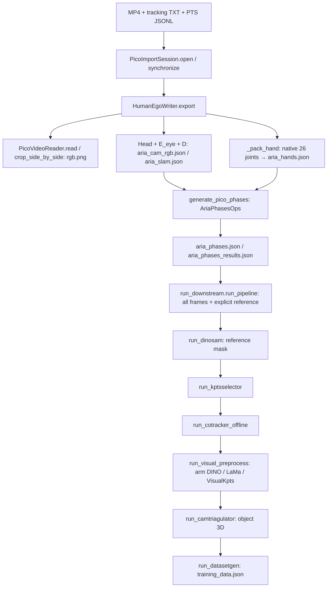

# PICO 现有流程审计（v3 修改前，2026-09-09）

实际仓库 `/home/yyn/workspace/HumanEgo`；分支 `autoresearch-humanego`；
HEAD `7d4a81a382f01cd75e42e85a15d5e03a6939acef`。
工作区已有大量用户修改及未跟踪文件，HEAD 不代表当前完整 baseline。
原始状态和源码副本保存于 `outputs/pico_v3_baseline/`，不切换分支、不重置。
本次按任务文档第 41 节先完成审计及双目 2D smoke，人工检查后才进行三角化。

## 真实调用图

重要区别：PICO `run_downstream.py` **不调用** `Preprocess.preprocess_indices`，
它读所有 rgb.png，由 CLI 指定 reference frame。不能把 Aria 的 indices 路径
误认为目前 PICO 的真实入口。外部 `pico_download/scripts/prepare_humanego_data.py`
封装 PTS 提取与导出；`run_open_door_vision_pipeline.py` 封装 `run_pipeline`。

## 逐项追踪

| 问题 | 当前真实实现 |
|---|---|
| 1. raw MP4/TXT | `recording.PicoImportSession.open`；`tracking_reader.load_tracking`；`video_reader.PicoVideoReader` |
| 2. 左右画面 | `crop_side_by_side` 严格要求全幅宽 2160，左右各 1080；writer 默认只导出左目 |
| 3. 内参 | `calibration.PicoCalibration.from_header` 解析 `[cx,cy,fx,fy]`，但实际投影使用已选定常量 `PICO4_ULTRA_KA`，并非直接使用 raw header |
| 4. 外参 | 同模块 `_matrix_pair` 解析 header；E1=左、E0=右 |
| 5. Head | `tracking_reader._pose7` / `load_tracking`，保留 direct Head.pose |
| 6. c2w | `HumanEgoWriter.export`: `H @ E_eye @ diag(D.T,1)`，world hand 不再乘 H |
| 7. 26 joints | `tracking_reader._hand` 读取 HandJointLocations 的 p/s/r，要求 26 点 |
| 8. hand representation | `humanego_writer._pack_hand` / `PICO26_TO_HUMANEGO21`，world → camera 并存 21 点、2D、26 点原始数据 |
| 9. T_hand_to_world | `DatasetGen._get_hand_pose_world` 用 `midpoint_translation_opt_world` 和 `midpoint_orientation_opt_world` 组成 SE(3)，在 `generate` 写出 |
| 10. virtual gripper | PICO `_midpoint_pose`：thumb/index tips 中点为原点；thumb/index base 与 wrist 定义轴。不是直接调用 Aria MidpointFrameBuilder |
| 11. grasp | `_pack_hand` 用 native joint 5/10 距离 <0.035 m，当前无 hysteresis、hold 或 hand-size normalization |
| 12. phase | `pico_phases.generate_pico_phases` 调 AriaPhasesOps 的 stop/v/w/yaw、hand velocity refine、inject_finished_phase；不是 object interaction |
| 13. phase 顺序 | writer 写完全部 camera/hand/slam 后，立刻计算 phase，object mask 尚不存在 |
| 14. indices | Aria `Preprocess.preprocess_indices` 消费 stage_window_check.windows，0/4 为 manipulation，1/2 navigation，3 transition；PICO 独立入口不消费这些 indices |
| 15. object stages | PICO reference DINO → KptsSelector → CoTracker → visuals → CamTriangulator → DatasetGen；object 3D 在 CamTriangulator 后才有 |
| 16. DatasetGen 输入 | 每帧 aria_cam_rgb.json、aria_hands.json、aria_phases.json（并检查 aria_slam.json）；全局 camtriangulator_results.json；mode=4 → metadata.is_finished=1 |

## 几何与现有能力的限制

- `aria_cam_rgb.json` 的 `d=[]` 仅表示当前 writer 没提供畸变参数，不能据此证明视频已去畸变或校正。
  当前 crop 未执行 undistort/rectify。raw / undistorted / rectified 状态仍需录制端证据，
  在确认前不开始 metric triangulation，也不另造标定。
- `preprocess/MediaPipeHands.py` 已有 HandLandmarker 模型加载、21 点顺序、
  `remap_mp_to_aria` 和 Aria 优化接口。其 `_recover_absolute_3d` 使用单目 hand-size/world landmarks，
  不能用作本任务的 metric hand depth。
- `scripts/visualize_mediapipe_mp4.py` 已分别运行左右 MediaPipe，但原实现按 nominal FPS 构造时间戳，
  自行 crop，只按 handedness 选配对，输出 z_norm。已有配对不是经过几何验证的对应点。
- PICO writer 的 raw/opt 字段目前相同，只有位置差分速度；没有真正的时序滤波。
  重建接入时必须处理退化轴和无效关节，不能沿用 `_safe_normalize` 的兜底轴生成假有效标签。

## KEEP / MODIFY / DO NOT TOUCH

| 类别 | 文件及计划 |
|---|---|
| KEEP | tracking_reader.py、calibration.py、recording.py 的解析和同步、既有 camera c2w、native debug 数据 |
| MODIFY，本轮 | 现有 MediaPipeHands 模型初始化提取为共享 helper；已有 visualize_mediapipe_mp4.py 补真实 PTS、统一 crop、QA；humanego_writer.py 增加仅 2D smoke 的入口 |
| MODIFY，2D 验收后 | 同一个 humanego_writer.py 内替换 hand source；同时间双目、质量门控、world transform、21 点接回现有 gripper；数学复杂时才拆纯 helper |
| MODIFY，hand 验收后 | 同一个 pico_phases.py 改 interaction state machine，独立 PICO config；run_downstream 最小顺序调整及可复用 object cue cache |
| DO NOT TOUCH | CoTracker、KptsSelector、object CamTriangulator、训练与 policy、原 camera/head 标定逻辑 |

## 后续最小实现方案

1. **本轮**：已有 writer 可运行仅双目 2D 分支；复用同一个 hand_landmarker.task，
   输出逐帧左右 21 个浮点像素点、handedness score、真实 PTS 和 tracking 对齐信息。
   输出明确不是最终 hand label；候选配对未做 epipolar 验证，不供 triangulation 使用。
2. **Hand**：确认 video geometry 后，handedness+confidence+epipolar/wrist 一对一匹配，
   同帧左右三角化，检查正深度、重投影、骨长/手尺寸、条件数；有效点用现有 c2w 转 world。
   复用 remap_mp_to_aria，保持下游字段。raw/filtered 分开，grasp ratio+迟滞+hold。
   不跨时间三角化，不用 MP z，不自动用 native 填补缺测。
3. **Phase**：当前 phase 前无 object cue。前置现有 DINO/SAM 的目标 mask 并建立带配置/帧身份的缓存，
   后续 reference 检测复用；先用图像归一化距离、approach、grasp、速度和 contact。
   PREPARE/REACH/GRASP/MANIPULATION/RELEASE/FINISHED 保留 numeric mode 兼容。
   不强行把原 PICO 全帧入口改造成 Aria indices pipeline。

## 基线与验收范围

`outputs/pico_v3_baseline/` 包含源码快照、git 状态、实际命令和日志。
真实 `20260908_174122` 重新运行原 native writer（camera/hand/slam/phase）。
另保存已跑通 Open Door `20260827_212621` 的 JSON（包括 training_data.json）以保留下游基线。
归档训练输出不等于新跑过完整 DINO/CoTracker/三角化；两者在 provenance 中明确区分。
本轮不做 policy retraining，也不宣称 phase F1、3D 精度或端到端改善已经得到验证。
